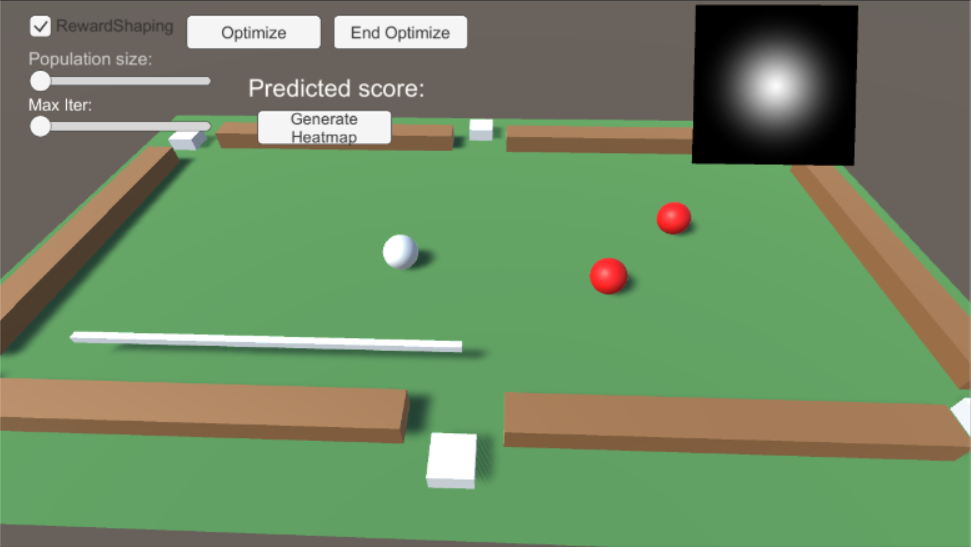
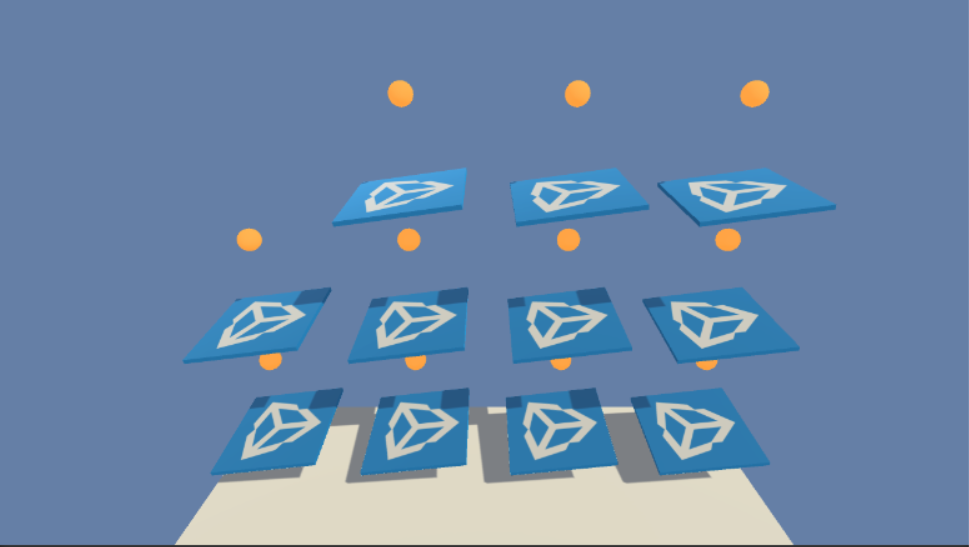
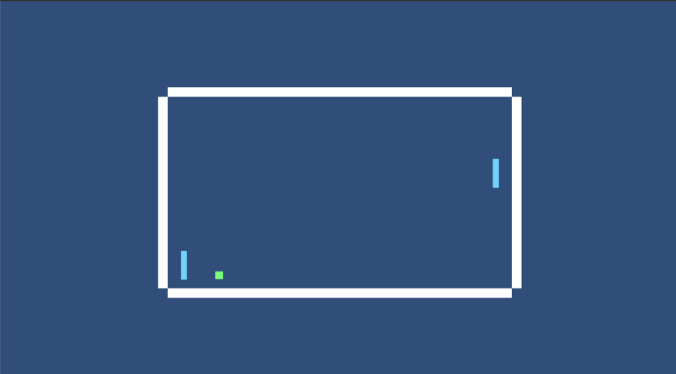
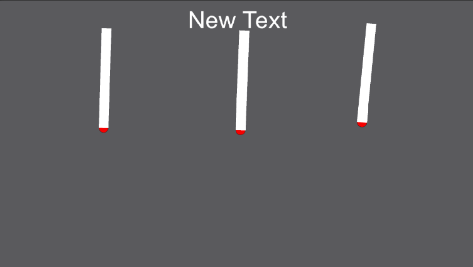
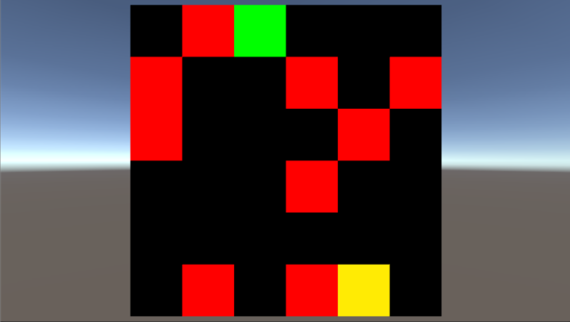
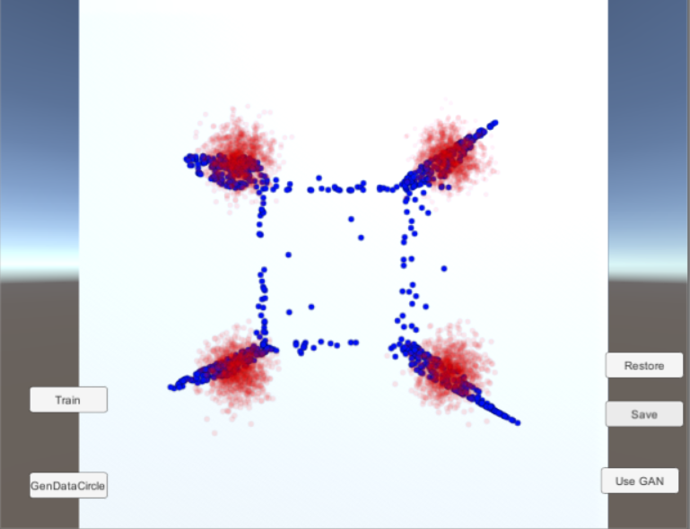
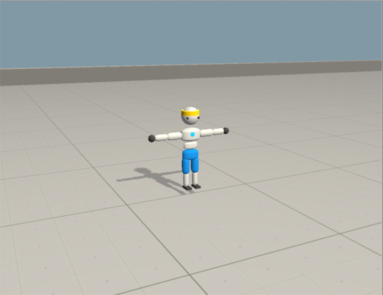

# Examples List
Our repo contains some examples which shows how to use all of our features. They are located under `Assets/UnityTensorflow/Examples`. 

Some of the examples are for our research purpose therefore do not actually work yet.

Below is a summary of those examples.

## IntelligentPool

    

This environment is one of the initial environment we used as test scene for educational purpose. We tried to apply different methods on it. Some of those are working some others are not. 

Please go [HERE](IntelligentPoolDetails.md) for the complete description and analysis of it. You can skip this one if you are just looking for simple examples.

## 3DBall

    

This is just a copy of the Unity ML-Agents' [3DBall environment](https://github.com/Unity-Technologies/ml-agents/blob/master/docs/Learning-Environment-Examples.md#3dball-3d-balance-ball), with modifications for in editor training, as a result of [Getting Started with Balance Ball](Getting-Started-with-Balance-Ball.md) tutorial. It uses PPO.

## Pong

    

Classic Pong game. Two agents play with each other in this game.

* Observation: Vector of size 6. the y positions of the agent itself and the opponent. Position and velocity of the ball. The observations are transformed so that each agent feels they are the agent at the left. 
* Scenes:
	- PongRL: 
    	- Use PPO algorithm. 
        - Discrete action space: up, stay, down. 
    - PongRLWithHeuristic: 
    	- Use PPO with heuristic.  The left agent collects extra training data from manual designed AI decisions and it is added to the regular PPO data collected from right agent for training.
        - Discrete action space: up, stay, down. 
    - PongSL: 
    	- Use supervised learning. The left agent uses manual control for collecting data. Once enough data is collected, it will start to supervised learning to train the brain.
        - Discrete action space: up, stay, down. 
    - PongSLGAN: 
    	- Use supervised learning. But the learning model is GAN instead of regular one. 
        - Continuous action space: vertical velocity. 
        
## Pole

    

A 2D physcis based game where the agent need to give a torque to the pole to keep it up.

* Continuous action space: torque.
* Algorithm: PPO.
* Scenes:
	- Pole: Vector Observation of size 2. Angular velocity and curren angle.
    - PoleVisual: Visual Observation. Game is modified so that the graphics shows the angular velocity.
    
    
## Maze

    

A game where the agent(yellow) has to reach to the destination(green) and avoid the obstables(red).

* Discrete action space: Up, Down, Left, Right.
* Algorithm: PPO.
* Scenes:
	- MazePPO: Vector Observation with size of the map(36 by default). Each color has different value.
    - MazePPOVisual: Visual Observation of size 32x32, colored. 

## GAN2DPlane

    

A simple demo of how to use GAN directly. 

You first generate the trainig data(red) by clicking `GenDataCircle`. Then go to the inspector of Plane, DataPlane2DTrainHelper, check the Training field it will start the training.

Click UseGAN to generate data from GAN(blue).

## Walker

    

A copy of Unity MLAgent's Walker example. A test scene for hybird training. Not working at all. Don't use it.
