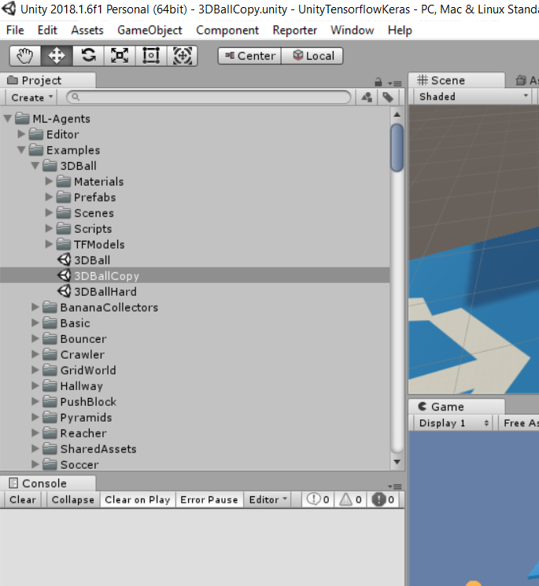
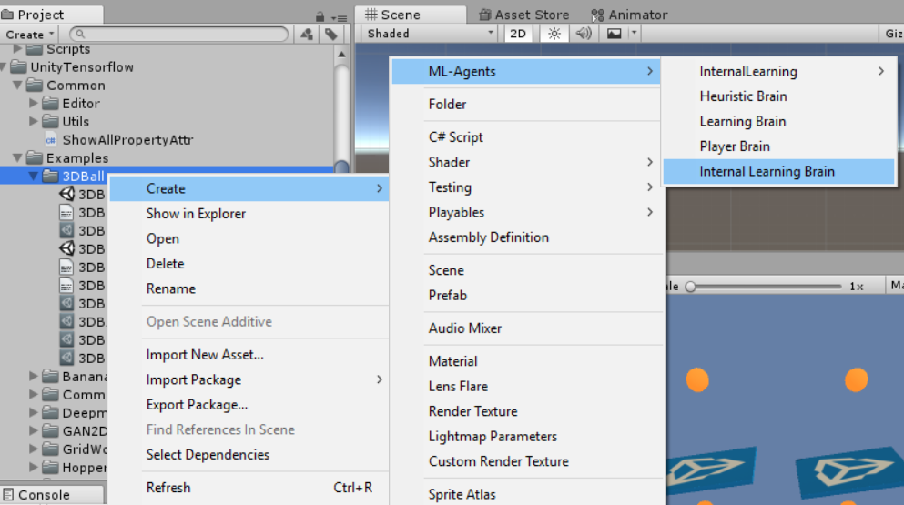
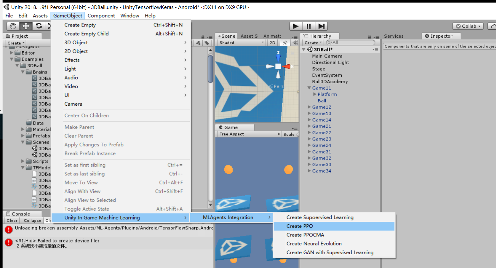
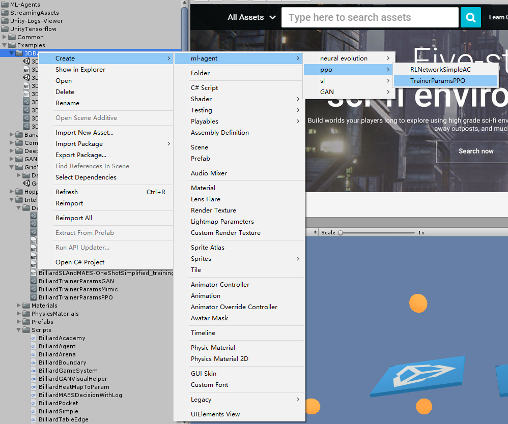
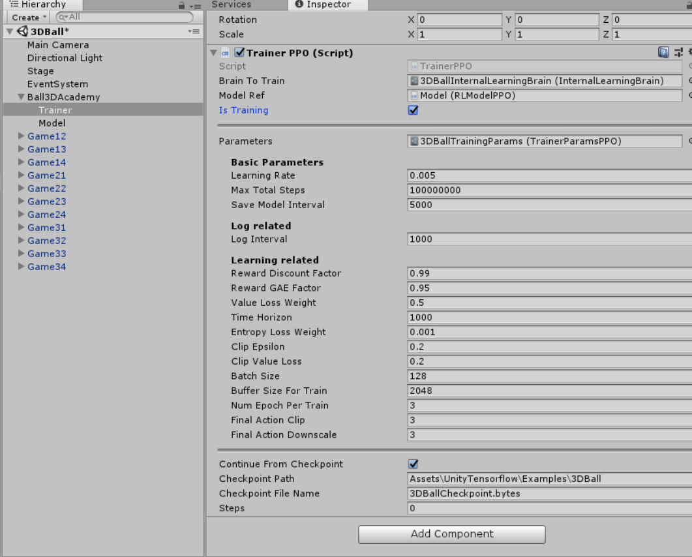
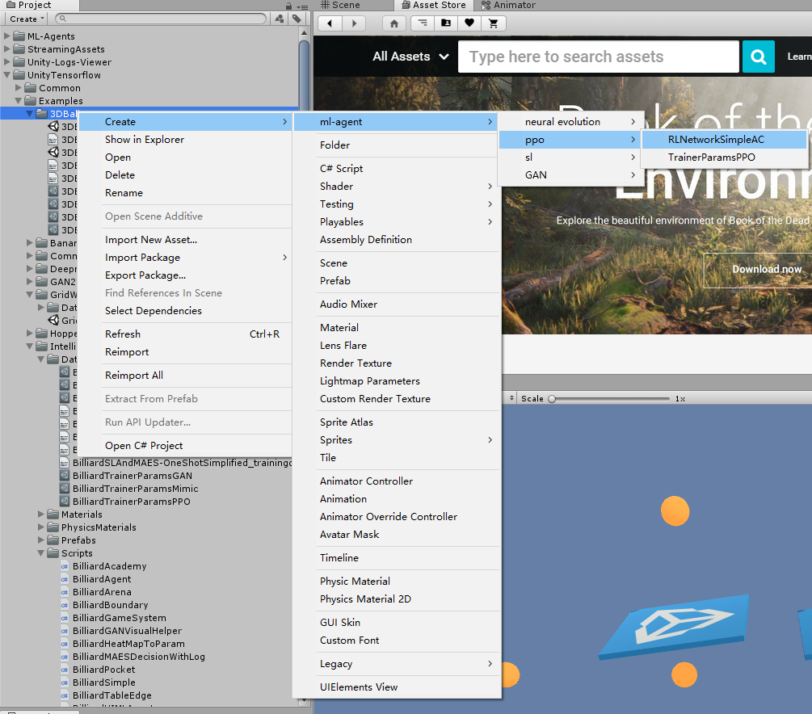
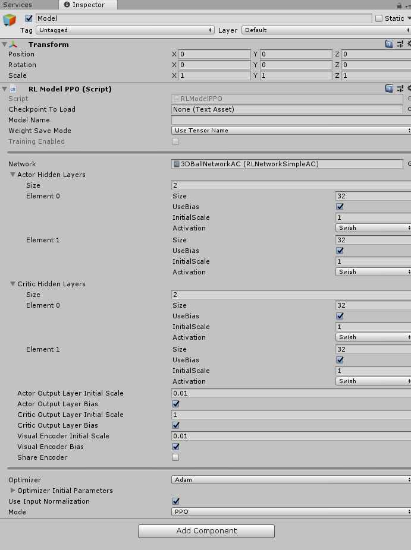
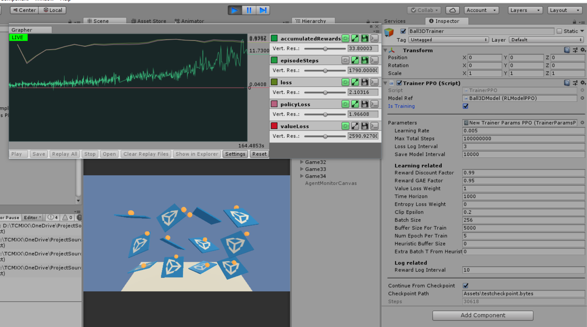

# Getting Started with the 3D Balance Ball Environment

This tutorial walks through the end-to-end process of converting the Unity ML-Agents' 3D Balance Ball environment into one that is trainable directly in Unity editor without coding extra stuff.

If you are not yet familiar with Unity's 3D Balance Ball Environment or you don't understant it at all, go to their [Understanding a Unity Environment (3D Balance Ball)](https://github.com/Unity-Technologies/ml-agents/blob/master/docs/Getting-Started-with-Balance-Ball.md#understanding-a-unity-environment-3d-balance-ball) section to understand what are Academy, Agent and Brain.

In this tutorial, we will use the default learning algorithm PPO(Proximal Policy Optimization) as in Unity ML-Agents.

## Steps
### 1. Copy the scene

In the examples diretories provided by Unity ML-Agents, find the scene 3DBall and duplicate the scene.

    

### 2. Create an Internal Learning Brain
We added a new type of brain called Internal Learning Brain, which should be used for training in game/editor instead of Heuristic Brain, Player Brain or Learning Brain.  
Create a new Internal Learning Brain scriptable object like how you create other type of brains, and copy the brain parameters from other brains provided by Unity ML-Agents for 3DBall environment.

    

Remember to replace the Brain field of all agents in the scene with the new created INternal Learning Brain. 

### 3. Create Trainer and LearningModel

Trainer and LearningModel are a set of C# classes we implemented for realizing different AI algorithms. They implement different C# interface and derive from Unity's Monobehaviour class. To run the AI learning and evaluation, you need to attached corresponding Trainer and LearningModel classes to GameObjects in the scene and setting them up based on the AI algorithm you want to use.

Luckily, we provided shotcut to create those stuff automatically for you.

In the Unity Editor's menu, select `GameObject/Unity In Game Machine Learning/Create PPO` to create every thing needed for AI using PPO algorithm, as in the following figure. It will ask you to select a directory to save the assets that design the learning parameters.

    

If everything goes normally, you will have a new GameObject called PPO_Learning in the scene, under which there are LearningModel_PPO and Trainer_PPO. Also, two scriptable object assets called NetworkPPO_3DBall and TrainerParamPPO_3DBall are created in the directory you just selected.

Next we will explain what are those assets and gameobject you just created, how to how to setup them up.

### 4. Setup Trainer and TrainerParam in the Scene

A Trainer class is something that handles the training process. It interact with the Brain class.

We implemented different Trainer classes for different learning algorithms. Here we use PPO therefore the Trainer class is called TrainerPPO. This script is attached to the Trainer_PPO GameObject you just created.

A trainer needs to know which Brain to train. Drag the just created Internal Learning Brain to the TrainerPPO's brainToTrain field in the editor.

A trainer ususally needs a set of hyperparameters. The automatic process has already created the parameter assets for you called TrainerParamPPO_3DBall, and assigned it to the TrainerPPO. If it is not created or assigned to the Trainer, you can manually do it as in the following figure.

    

Finally check the Is Trainer field in the Trainer. The Trainer in the inspector should look like following. You can adjust the hyper parameters in it if you know what they mean. The trainer should look like below:

    

### 5. Setup  LearningModel and Network in the Scene
A LearningModel class contains the high level interface to use the neural network for different learning algorithm. The Trainer class will communicate with the LearningModel to train the neural network and query actions. 

We implemented different LearningModel classes for different learning algorithms. Here we use PPO therefore the LearningModel class is called RLModelPPO. This script is attached to the LearningModel_PPO GameObject you just created.

In our codes, most of LearningModel need a Network scripable object to define the detailed structure of the neural network, including how many hidden layers and so on. You can also easily write your own network.  The automatic process has already created the parameter assets for you called NetworkPPO_3DBall, and assigned it to the RLModelPPO script attached. If it is not created or assigned to the RLModelPPO, you can manually do it as in the following figure.

    

The LearningModel_PPO in the inspector should look like following. You can adjust the network parameters in it if you know what they mean.

    

## Click Play and Start!
You can click Window/Grapher from menu to monitor your training process.(It is a modified version of old Grapher, when it was still free. It seems to be not free nor opensource anymore...I will remove it if it is causing any problem.). The parameters are not well tuned, but the agent should be able to learn something at least within a minute.

You can also toggle the IsTraining field on Ball3DTrainer in inspector to enable/disable training.

The trained data will be saved at the relative path specified in the Checkpoint Path field in Trainer. How often it is saved depends on the trainer parameters.

