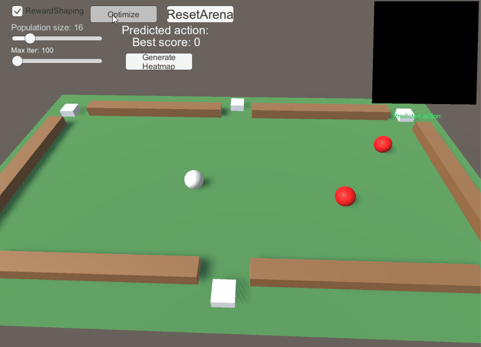
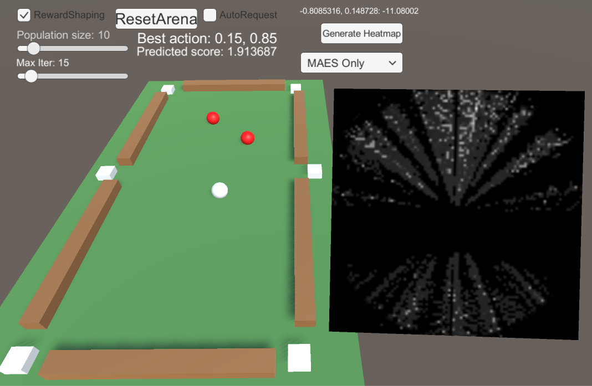
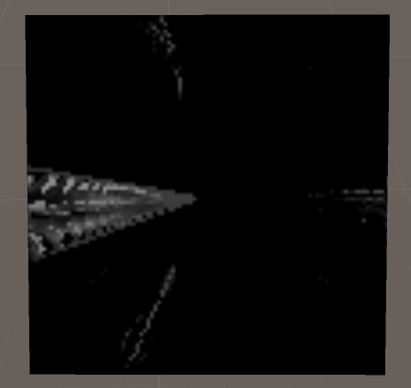
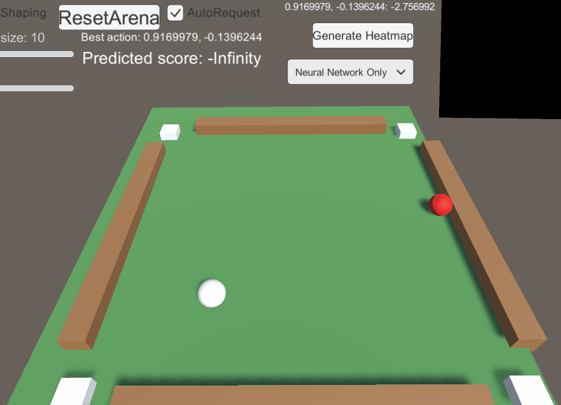
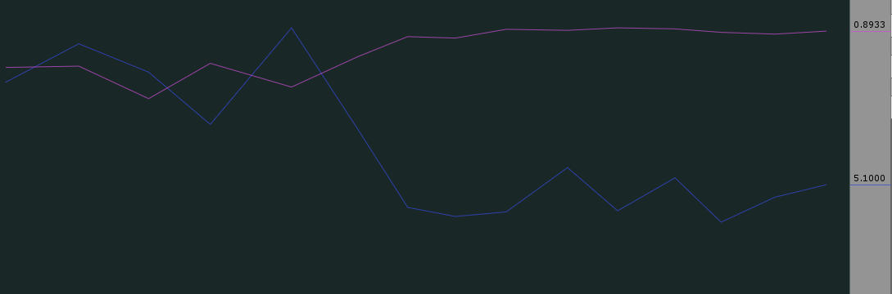

# IntelligentPool

## Introduction
From now on, we will call the game billiard instead of intelligent pool because I feel like to.

The general name of those types of those games is cue sport(See [Wikipedia](https://en.wikipedia.org/wiki/Cue_sports)), and there are many of them. In general, you need to use a stick to hit the white ball so that the white ball hits the other balls and they go into the pockets. The game may look like this:

    

During the development of the materials for the Computational Intelligence in Games course, we decided to develop a whole set of examples with the billiard game, using different technologies, to showcase the concepts and power of each. The start of the examples is a simple case where the AI only need to hit the white ball once and try to make both of the red balls on desk into pockets, using [MAES-need link](something) algorithm. The final goal is to develop a AI that can play a whole game with itself, where it should plan not just one shot but multiple shots and prevent the opponents from getting advantages, using [PPO-need link](something). 

    

In the end, at least until now, PPO is not working at all. We ended up make a even simpler case than the simple case in the beginning, with only one red ball and 4 pockets, and the game restarts after every shot.  

    

Here I will go through the development process, describe each example scenes, tell how to play with them, and explain why I think the billiard game does not work directly with pure PPO or supervised learning.

## What we have tried
Here is the list of what we have tried and their results:

1. Simple case with 2 red balls and 6 pockets. Use `MAES` to find the optimized solution for `one shot`. 
	- It works if the reward function is well defined., but quite slow because it needs to simulate a lot of shots.
2. Simple case with 2 red balls and 6 pockets. Use `MAES` to find the optimized solution for `two consecutive shots`. 
	- Again, it works well if the reward function is well defined, but slow.
3. Simple case with 2 red balls and 6 pockets. Use `Supervised Learning` together with `MAES` for `one shot`. The neural network tries to remember from the results of MAES what the best action is under certain observation,  and the output of the neural network will be again used as initial guess of MEAS to reduce the time to find the optimal solution.
	- The supervised learning does not work. It won't learn anything meaningful to help the MAES.
4. Simple case with 2 red balls and 6 pockets. Use `PPO` only. 
	- Not work, and it won't work.
5. Even simpler cacse with 1 red ball and 4 pocket on a square table. Use `Supervised Learning` together with `MAES` for `one shot`. Reward function is reshaped heavily.
	- The supervised learning can learn to hit red balls now. Sometimes it can shot well without MAES.
6. Same as 5 but with GAN(TBD).

Next those cases will be discussed one by one in details.

### Case 1 - 2 red balls, 6 pockets, one shot, MAES
*	Scenes: BilliardMAESOnly-OneShot-UseMAESDirectly and BilliardMAESOnly-OneShot-UseTrainer
*	If the reward function is not shaped, that is, one point for each red ball that ends up in pockets after one shot, the MAES is very like to not be able to find the best solution. The reason is simple: initial random samples are likely to all have 0 point, therefore the algorithm is not able to find next generation of better children.
*	If we shape the reward so that if the red balls end up being close to the pockets, extra reward is given, then MAES is able to find a good solution after couple of iterations.

    

  <em>MAES Demo</em>

### Case 2 - 2 red balls, 6 pockets, two shot, MAES
* Scenes: BilliardSLAndMAES-MultiShot(Select MAES only in the scene)
* Instead of trying to find one best shot, in this case, the optimizer tries to find two consecutive shots that might have best result.
* Result: As the Case 1, works with reward shaping. It is able to find a good action to take, but the optimization takes more time because it needs to evaluate two shots and the action space dimension is 4 instead of 2, which is larger for the optimizer to search.

### Case 3 - 2 red balls, 6 pockets, one shot, MAES and Supervised Learning
* Scenes: BilliardSLAndMAES-OneShot
* Result: the neural network does not learn anything meaningful to help MAES.

The goal for this case is to let the neural network learn a initial guess that is better than random, and with the help of this guess, the optimizer should be able to find the best result faster. The neural network learns from the collected data from running the scene with MAES only, using supervised learning.

The collected data is a list of states(position of balls)/action(best action found by MAES) pairs. The supervised learning tries to make the neural network memorize the pairs so that giving the neural network an input states, it can output an action that is close to what MAES will find.

The idea sounds good, and it has been proven to be working well in some scenarios. But for our case, it just does not work. The trained neural network still often outputs an action that is no even close to the best action that a hunam being or MAES might choose. It is misleading the MAES optimizer rather than helping it. 

Why is it like this? 

The first problem comes from the discontinuous distribution of optimzal solutions. Let's look at the following image with a heatmap of all possible shots in certain states.

    

  <em>Heat Map of all possible shots</em>

In the heat map at the right side of the above image, the whiter a pixel is, the higher score it is to shoot at with correcponding parameters. In the middle of the map, it shoot with zero force, and angle/distance from center means the shoot direction/force magnitude respectively.

The most white pixels, which basically means both of the red balls are going to get in pocket with those shots, are very rare. However, there are plenty of less white pixels, which means one of the red balls will be in pocket, are scattered around quite a lot.

Since the perfect white pixels are rare, when optimizing with MAES, it is not very likely that it can find the optimal solution every time. Also, because the less white pixels are scattered around, the sub optimal solution found by MAES might be quite different every time as well. Therefore, when collecting the state/solution pair data from MAES results, one thing happens it that: For states that are very similiar, the solutions might vary a lot!

So what is the consequence of various solutions to similiar states? 

For supervised learning, it usually tries to reduce the error between its own outputs and desired outputs from training data for different state inputs. Regular neural network can not generate multiple discontinuous outputs
 with the same input, therefore, it tries to output an average of all desired outputs in training data.
 
In our case, the supervised learning neural network learns to output the average between some of the whiter-pixel positions. If you randomly pick some white pixels and spot their average position, it is likely to be just a grey or black pixle on the heat map! This is one of the reason why our neural network can not learn anything helpful!
 
You might as is there a way to solve the problem and let the neural network learn generate multiple outputs? Some people might think of [GAN-need link](something). However, considering neural network does not really represent disconinuous functions(you can still approximate, but that is hard. See [Reference](https://www.quora.com/How-can-we-use-artificial-neural-networks-to-approximate-a-piecewise-continuous-function)),and GAN is stremely hard to train, I don't think it is worth trying it on this case. 

Another minor reason why it is hard to train the neural network for our case is that, the optimal outputs might change a lot with only small change of input states. This makes the it requires more training data and larger neural network to be able to remember all different situations. I did not try to collect more data or use larger network, becaue the first problem is already hindering me  and I don't have enough time to collecting the data.

In the end, I made a even simple enough case that does not have the problems above, before which I tried PPO, which did not work as expected.

### Case 4 - 2 red balls, 6 pockets, one shot, PPO
* Scenes: BilliardRL-OneShot
* Result: I have not been able to produce good result with short time training yet.

### Case 5 - 1 red ball, 4 pockets, one shot, MAES and Supervised Learning
* Scenes: BilliardSLAndMAES-OneShotSimplified

This case, the same method is used as in case 3, but with much simpler scenario. Here is the screenshot of the scene and the heatmap.

    

According to the heatmap, now the "better solutions" are not that scatterd as in case 3 anymore. That means it is easier for MAES to find the optimal solutions and the average solutions learned by neural network make more sense.

After collecting 20000 samples and training the neural network as in case 2 for a little while, the neural network is at least able to shoot at the red ball and sometimes pocket it.

    

  <em>With neural network only</em>

If we use the output from neural network as the initial guess of the optimizer, the iteration count is about reduced from 10 to 5 in our case. Nice!

    

### Case 6 - 1 red ball, 4 pockets, one shot, MAES and Supervised Learning using GAN
Scenes: BilliardSLAndMAES-OneShotSimplified-GAN

