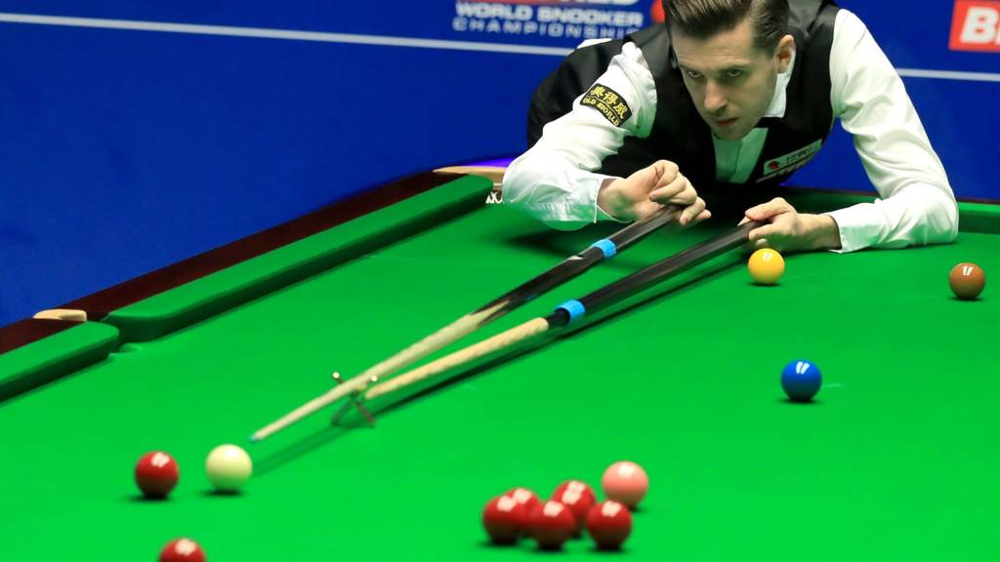
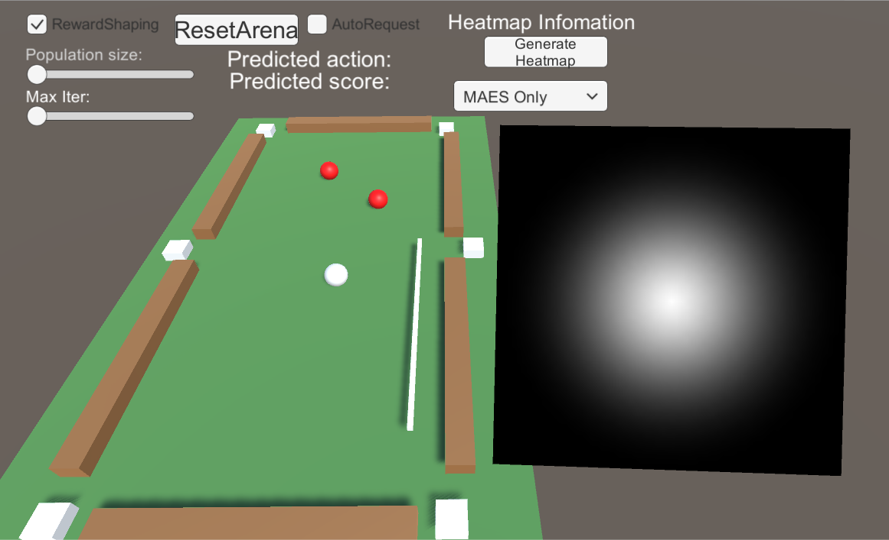
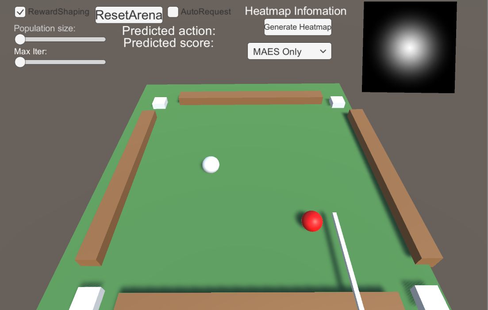

# IntelligentPool

## Introduction
From now on, we will call the game billiard instead of intelligent pool because I feel like to.

The general name of those types of those games is cue sport(See [Wikipedia](https://en.wikipedia.org/wiki/Cue_sports)), and there are many of them. In general, you need to use a stick to hit the white ball so that the white ball hits the other balls and they go into the pockets. The game may look like this:

    

During the development of the materials for the Computational Intelligence in Games course, we decided to develop a whole set of examples with the billiard game, using different technologies, to showcase the concepts and power of each. The start of the examples is a simple case where the AI only need to hit the white ball once and try to make both of the red balls on desk into pockets, using [MAES-need link](something) algorithm. The final goal is to develop a AI that can play a whole game with itself, where it should plan not just one shot but multiple shots and prevent the opponents from getting advantages, using [PPO-need link](something). 

    

In the end, at least until now, PPO is not working at all. We ended up make a even simpler case than the simple case in the beginning, with only one red ball and 4 pockets, and the game restarts after every shot.  

    

Here I will go through the development process, describe each example scenes, tell how to play with them, and explain why I think the billiard game does not work directly with pure PPO or supervised learning.

## What we have tried
Here is the list of what we have tried and their results:

1. Simple case with 2 red balls and 6 pockets. Use `MAES` to find the optimized solution for `one shot`. 
	- It works if the reward function is well defined., but quite slow because it needs to simulate a lot of shots.
2. Simple case with 2 red balls and 6 pockets. Use `MAES` to find the optimized solution for `two consecutive shots`. 
	- Again, it works well if the reward function is well defined, but slow.
3. Simple case with 2 red balls and 6 pockets. Use `Supervised Learning` together with `MAES` for `one shot`. The neural network tries to remember from the results of MAES what the best action is under certain observation,  and the output of the neural network will be again used as initial guess of MEAS to reduce the time to find the optimal solution.
	- The supervised learning does not work. It won't learn anything meaningful to help the MAES.
4. Simple case with 2 red balls and 6 pockets. Use `PPO` only. 
	- Not work, and it won't work.
5. Even simpler cacse with 1 red ball and 4 pocket on a square table. Use `Supervised Learning` together with `MAES` for `one shot`. Reward function is reshaped heavily.
	- The supervised learning can learn to hit red balls now. Sometimes it can shot well without MAES.
6. Same as 5 but with GAN(TBD).

Next those cases will be discussed one by one in details.
### - 2 red balls, 6 pockets, one shot, MAES

