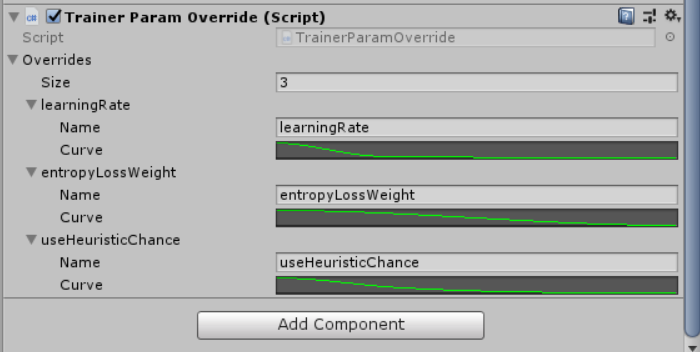

# TrainerParamOverride

If you need your trainer parameters to change over the training process(which quite often is needed), for example, decreasing the learning rate, you can use this helper script to easily to do that.

For any trainer that inherits from `Trainer` class on a GameObject, you can also attach the script TrainerParamOverride.cs to the GameObject to modify the parameters during the training based on training steps.

    

The `overrides` array defines all the parameters you want to change during the training and how to change them.

For each override, there are two fields:
* name: The name of the parameter you want to change. The name should be the name in the scriptable object script, not the one shown in inspector(because unity added spaces between words and captilize the first letter).
* curve: The changing curve of the parameter. The x axis of the curve is the ratio between (current steps of trainer)/(maxTotalSteps defined in the trainer parameter). The y axis of the curve is the factor to multiply on the initial value of that parameter defined in the trainer parameter.
